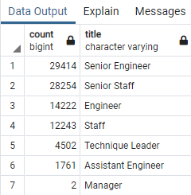
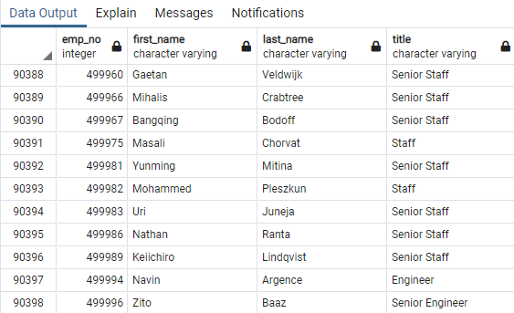
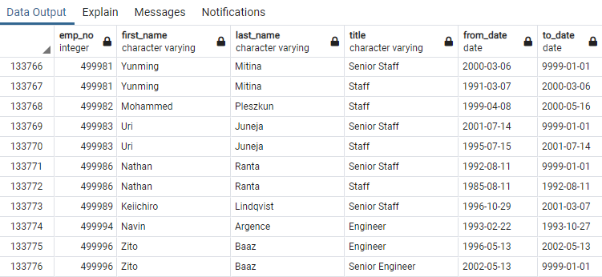
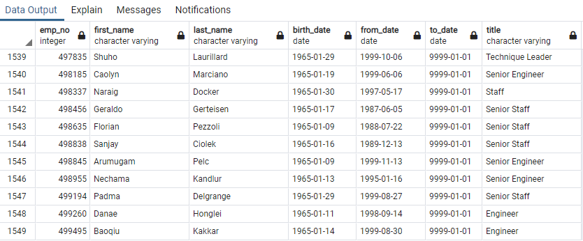

# Pewlett Hackard Analysis

## Project Overview

Pewlett Hackard is a large company with thousands of employees and has been in business for very long. As a generation of employees begins to retire at a rapid rate, Pewlett Hackard is planning for the future in two ways. I am helping Bobby, and up-and-coming HR Analyst who specifically needs to find an answer to two questions. First, who will be retiring in next few years? Second, How many positions does Pewlett Hackard needs to be filled?

The employee data is available in 6 CSV files but we would perform the analysis in SQL. After importing the data from CSV files to the databases and some initial analysis, Bobby's manager has given us two more assignments:
1. Determine the number of retiring employees per title
2. Identify employees who are eligible to participate in a mentorship program based on certain criteria

## Four Major Points from Deliverables

1. **It is the senior positions which needs to be filled the most.** Looking at Retiring Titles table, the employees with Senior Engineer title are retiring the most in next few years with a count of 29,414. Employees with Senior Staff as title form the second largest group with a count of 28,254. The sum of counts of these two titles (57,668) is larger than the sum of rest of the titles (32,730).

    

2. **A total of 90,398 employees are retiring.** This is big number and hence Pewlett Hackard will need to have an aggressive plan in order to fill these vacancies.

    

3. **An employee in Pewlett Hackard on an average holds 1.47 titles during the time they are working for the company.** There are a total of 133,776 rows in the Retirement Titles table with some employees holding 2 or 3 titles during their time in Pewlett Hackard. Divided by number of employees retiring (90,398) we get an average of 1.47.   

    

4. **1,549 are eligible for mentorship program.** There are a total of 1,549 current employees who were born between January 1, 1965 and December 31, 1965. These employees are all eligible for mentorship program.  
    
    

## Summary
1. A total of *90,398 roles* will need to be filled as "silver tsunami" begins to make an impact. This is the number of employees (or rows) in Unique Titles table. 

    Given below is the query to find the same:

    `SELECT COUNT(emp_no) FROM unique_titles;`

    Alternatively, we can also find the sum of "count" column in Retiring Titles table: 

    `SELECT SUM(count) FROM retiring_titles;`

2. There are a total of *1,549 employees* who are eligible for mentorship program. This the number of employees (or rows) in Mentorship Eligibility table. This means each of these mentors will provide mentorship to about *58 next-generation employees*, which is a high number of employees to provide quality mentorship.

    Given below is the query to find the same:

    `SELECT COUNT(emp_no) FROM mentorship_eligibilty;`